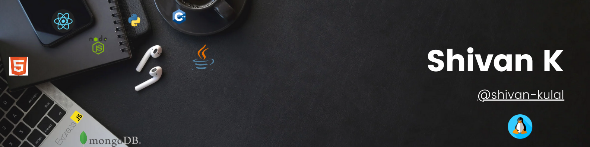

<!--
**shivan-kulal-git/shivan-kulal-git** is a ✨ _special_ ✨ repository because its `README.md` (this file) appears on your GitHub profile.

Here are some ideas to get you started:

- 🔭 I’m currently working on ...
- 🌱 I’m currently learning ...
- 👯 I’m looking to collaborate on ...
- 🤔 I’m looking for help with ...
- 💬 Ask me about ...
- 📫 How to reach me: ...
- 😄 Pronouns: ...
- ⚡ Fun fact: ...
-->

<h1 align="center">Hi 👋, I'm Shivan</h1>
<h3 align="center">A Passionate Coder from India, Creating for Fun and Innovation</h3>

---

## 💫 About Me
- 🔭 I’m currently working on ....... 🤔
- 🌱 I’m currently learning Azure
- ⚡ Fun fact: The first computer "bug" was an actual bug.

## 🔧 Skills
### 💻 Tech Stack:
                         

### 💻 Full-Stack Web Development
- **Backend:**     
- **Databases :**  
- **Frontend:**     
- **Mobile Development:** 

<!--
### 🤖 Machine Learning
- **Libraries & Frameworks:**       

### 🧑‍💻 Programming Languages
-     
-->
---

## 📫 How to reach me
- **Email:** [kshivan48@gmail.com](mailto:kshivan48@gmail.com)

---

## 🌐 Connect with me

    

---

## 📊 GitHub Stats

    
    
    

---

## 🏆 GitHub Trophies

    

---

 
   

